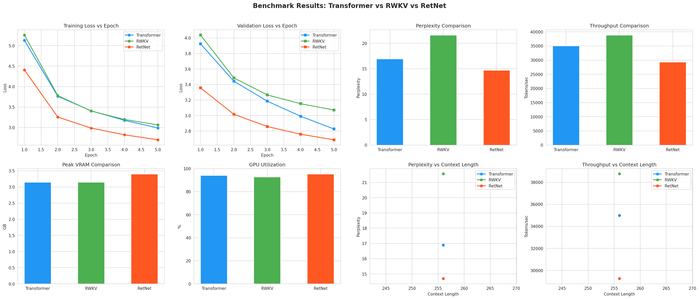

# Transformer vs RWKV vs RetNet — Training Benchmark

A from-scratch training benchmark comparing three sequence-modeling architectures —
a standard Transformer decoder, RWKV, and RetNet — on the same data, same training
budget, and same hardware, to compare loss/perplexity, throughput, VRAM usage, and
GPU utilization.

## What this is

Three small language models (Transformer, RWKV, RetNet) are trained from scratch
for a fixed number of epochs on identical data and tokenizer, then compared on:

- Training loss / validation loss per epoch
- Validation perplexity
- Training throughput (tokens/sec)
- Peak VRAM usage
- Average GPU utilization
- How each metric scales with sequence length

## Hardware & run setup

- **GPU:** NVIDIA T4 (Google Colab, free tier)
- **Sequence lengths tested:** 128 and 256
- **Epochs per model:** 5

> **Note on sequence length coverage:** Larger sequence lengths (512+) were not
> benchmarked. The T4's 16 GB of VRAM and Colab's free-tier compute budget weren't
> enough to train all three models at longer context lengths within a reasonable
> time/memory budget — RetNet and RWKV in particular grow expensive at longer
> sequences on a single T4. Results below should be read as representative for
> short-context (128–256 token) regimes only; relative rankings may shift at
> longer context lengths on stronger hardware (e.g. A100/H100).

## Results (seq_len 128 & 256, 5 epochs)

| Model       | Final Train Loss | Final Val Loss | Perplexity | Tokens/sec | Peak VRAM | GPU Util |
|-------------|------------------:|----------------:|-----------:|-----------:|----------:|---------:|
| Transformer | ~3.0              | ~2.8             | ~16.9      | ~35,000    | ~3.1 GB   | ~94%     |
| RWKV        | ~3.1              | ~3.1             | ~21.5      | ~38,500    | ~3.1 GB   | ~93%     |
| RetNet      | ~2.7              | ~2.6             | ~14.5      | ~27,500    | ~3.35 GB  | ~95%     |

*(Approximate values read from the generated charts — see `benchmark_results.json`
and `all_graphs.png` for exact numbers.)*
### Benchmark Results — Sequence Length 128

### Benchmark Results — Sequence Length 256
.png)

*Figure: Training/validation loss, perplexity, throughput, VRAM, and GPU utilization across Transformer, RWKV, and RetNet at sequence length 256 (T4 GPU).*
### Takeaways at this scale

- **RetNet** achieved the lowest training/validation loss and perplexity of the
  three, suggesting the best sample efficiency in this short-context, small-scale
  setting — but at the cost of the lowest throughput and highest VRAM use.
- **RWKV** trained fastest (highest tokens/sec) but converged to the worst loss
  and perplexity of the three.
- **Transformer** landed in between on most metrics — a reasonable default
  baseline.
- GPU utilization stayed high (~93–95%) across all three, meaning the GPU was the
  bottleneck rather than the data pipeline.

These results are from a small-scale, short-context run on a single T4 GPU and
shouldn't be generalized to large-scale or long-context training without further
testing on stronger hardware.

## Generated artifacts

- `benchmark_results.json` — raw per-epoch metrics for all three models
- `all_graphs.png` — 8-panel summary figure (loss curves, perplexity, throughput,
  VRAM, GPU utilization, and metric-vs-context-length scatter plots)

## Bugs fixed in this version of the script

The original script had a few issues that were fixed before this run:

1. **`!pip install ...` Colab magic commands** left in the `.py` file caused a
   `SyntaxError` when run as a plain script — replaced with a `pip install`
   instruction to run manually beforehand.
2. **Double-transpose bug in `RetNetModel.forward`** — the input was transposed
   to `(T, B)` and then transposed *again* before being passed to RetNet,
   silently cancelling the first transpose and feeding data in the wrong layout.
3. **Orphaned duplicate `forward()` method** floating at module scope (outside
   any class, referencing `self`) — dead code left over from an earlier edit,
   removed.
4. **`make_serializable()` used before it was defined** — it was called inside
   the training loop but only defined ~90 lines later in the file, causing a
   `NameError` on the very first epoch. Moved its definition above the loop.
5. **Hardcoded `seq_len=512`** in the graphing section, while `SEQ_LENGTHS` only
   included `[128, 256]` — caused a `KeyError: 512` when plotting. Updated to
   reference the sequence lengths actually trained.

## How to reproduce

```bash
pip install torchscale transformers rwkv pynvml torch matplotlib seaborn numpy
python transformers_benchmark.py
```

Adjust `SEQ_LENGTHS`, `EPOCHS`, `EMBED_DIM`, `NUM_LAYERS`, etc. at the top of the
script to change the benchmark configuration. Note that increasing sequence length
or model size will increase VRAM and time requirements significantly — a T4
(16 GB) is a reasonable lower bound for this benchmark's current settings, but
larger sequence lengths will likely need a GPU with more VRAM (A100/H100) and/or
gradient checkpointing.
